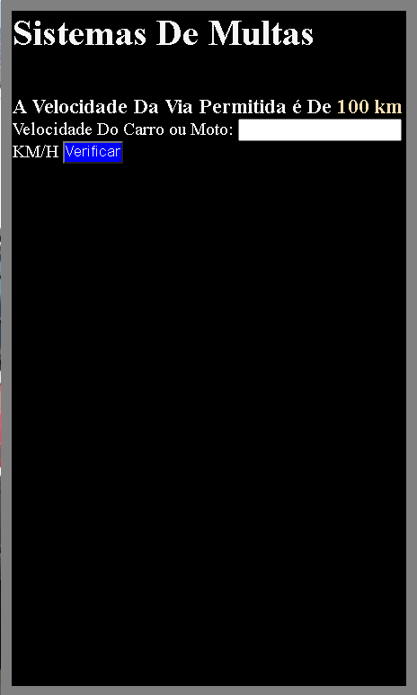
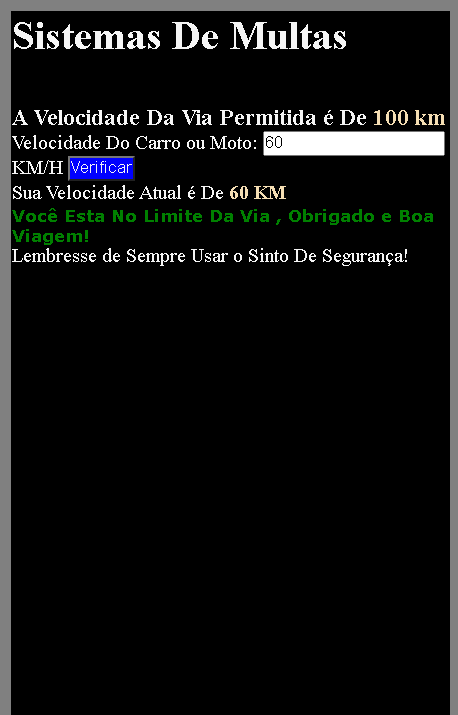

<h4> Exercicio if - Else <h4> 

Exemplo usado é uma via de transito com o limite definido de 100km/h, caso você ultrapasse
esse limite o Javascript vai te dar uma resposta nas duas situações. 

Segue as Fotos EX 

se Você Estiver no Limite da Via de trânsito ele vai dizer que você esta no limite permitido.

caso você passe desse limite ele dizer que você ultrapassou e vai te dar uma multa.

